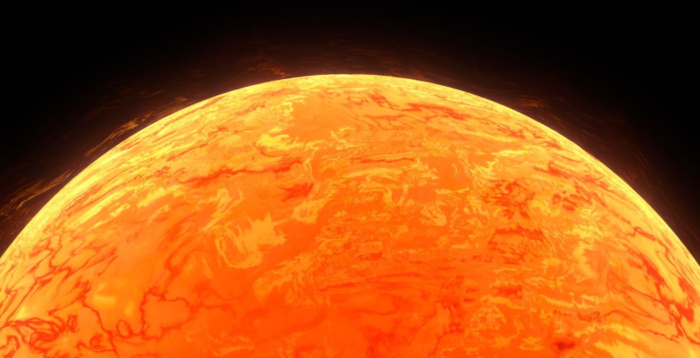
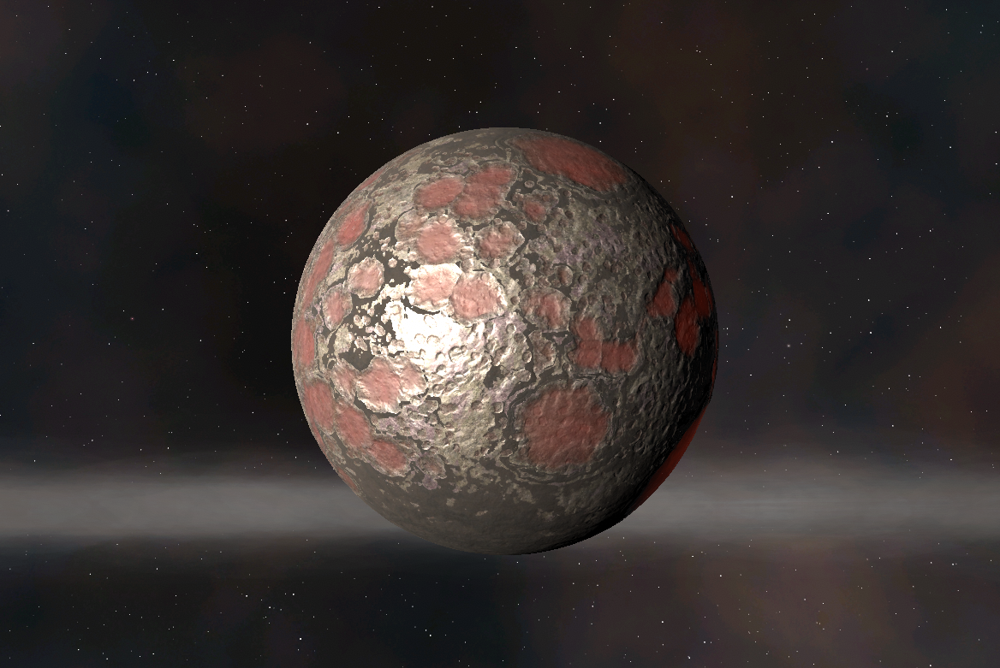
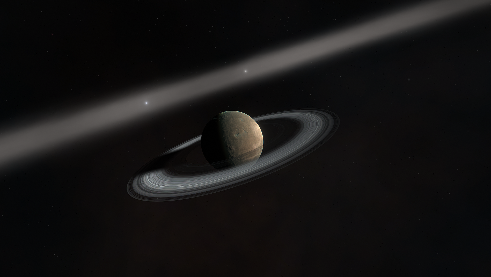
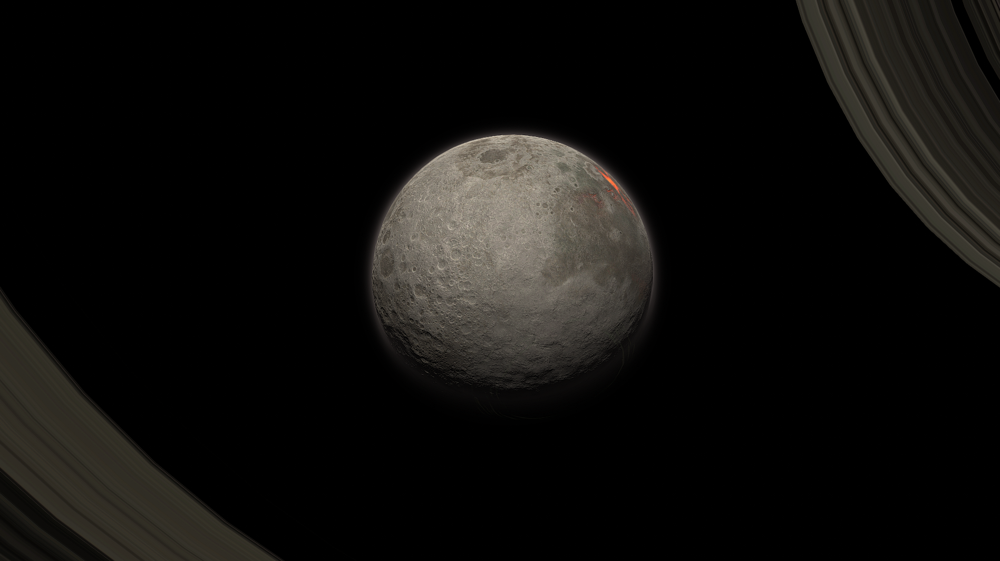
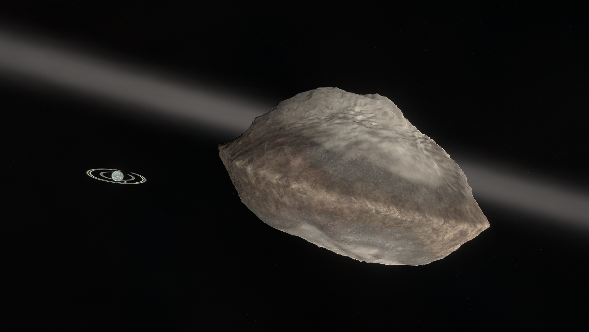
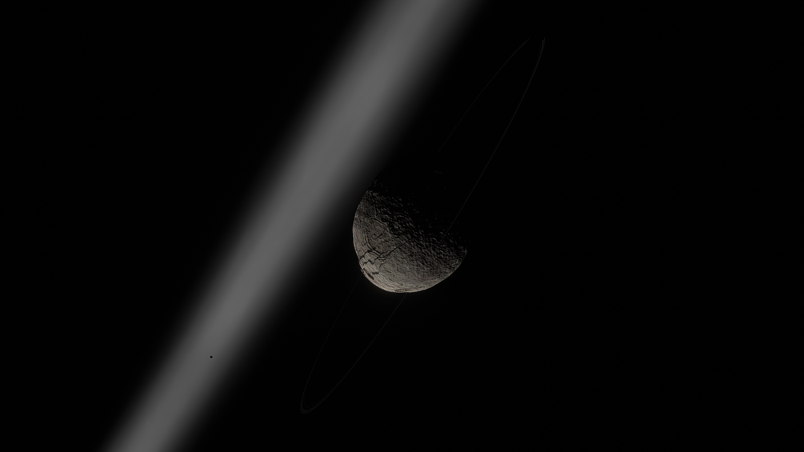
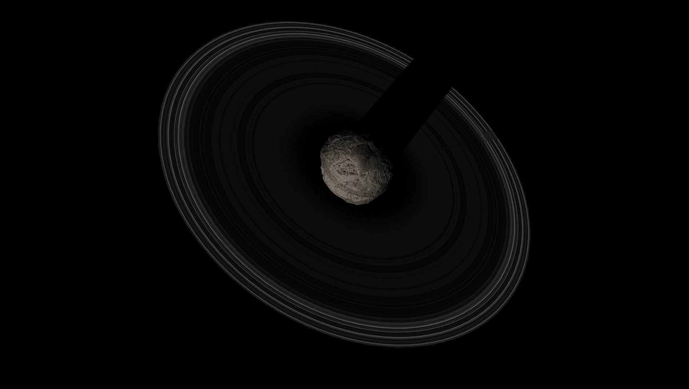

# The Debdeb System

## **MAPS**

## **DESCRIPTION**

Centered within a vast protoplanetary disk, the Debdeb System is a young star system only a few light-years from Kerbol. Debdeb's planets are a glimpse of a distant past: there's Charr, a fiery, iron-bound ancestor of Moho; Gurdamma, a cratered oasis teeming with the ingredients for life; Ovin, a superheavy wasteland with gorgeous rings; and much, much more. Want to surf on the **MASSIVE** low-gravity cliffs of Axod? Dive into the storms of Dorau? or perhaps witness the Cryovolcanoes of Bis? in Debdeb, you'll feel right at home!

## **SYSTEM LAYOUT**

- Debdeb - On the cosmic timescale, Debdeb is a baby star. 10 million years ago, a large cold cloud of gas and dust collapsed due to gravity and formed this orange dwarf star. However, due to it's age, its slightly larger than Kerbol, and vastly more active, which leads to lots of solar activity. Surrounding it is a proto-planetary disk containing the ingredients for new planets. The planets have also had the proper time to clear their orbits, making the ring-like structure of the proto-disk. Within this disk orbits 6 young planets, each with gripping stories to tell.

- Charr - Do you love sunbathing? Charr is your new best friend. This bombarded hunk of iron is snuggled up right next to Debdeb, glowing bright red from the heat. Despite being smaller than Kerbin, its mighty density gives it almost twice the gravity of Kerbin! There's likely an abundance of rare metals and materials here.

- Ovin - A choked atmosphere, a shattered surface and gravity that will tear you to shreds. Ovin is terrifying. We don't know how a planet like it could form. Everything about it defies our understanding of terrestrial planets. Its discovery gave many scientists nightmares for weeks afterwards.

- Gurdamma - Gurdamma's bombarded surface, rapid spin and large close moon are evidence of a massive collision in the recent past. This along with its size and mass means that this young planet offers a glimpse at what early Kerbin may have looked like. Tidal forces exerted on Gurdamma from its largest moon, Donk, create giant tidal waves and extreme global volcanism. The plumes from these volcanoes reach high into the atmosphere and are one of the most prominent features when the planet is viewed from space.

 

- Donk - Donk was allowed to be named by a public vote and is now a permanent reminder to never do that again. This young moon is constantly being squeezed and stretched by Gurdamma, causing volcanism and massive tears to open in the crust, giving us a view into the mantle. It resembles our own Mun in many ways; maria, dense crater fields, same gray color, etc. Donk has a temporary atmosphere that is getting blown into space by the solar wind.

  

- Kevba's Anomaly - A wormhole that connects the Kerbolar system with the Debdeb system. Orbits Gurdamma. Its other side is located in Dres orbit. (Only existing via enabling wormholes.)
(No image provided for Wormholes)

- Gup - This little nugget was flung into a far elliptical orbit, likely after the recent collision that formed Donk. It spins very fast which has flattened it into a disk shape. Landing around the equator is extremely difficult thanks to this spin.

    

- Lapat - Lapat's thick carbon dioxide wraps it in an eerie shroud. Through the smog, we can just about make out dots of foamy water amongst dunes of white sand. Lapat's most striking features are its great mesas that climb high into the sky, escaping the soupy environment around their bases. If you fancy a hot summer day then Lapat is the place! Unless you also fancy suffocating and being crushed like a can..... Pluses and minuses.

(No image as Lapat is still WIP)

- Axod - The skewed dwarf planet Axod spins so fast that its hemispheres have offset over time, giving it a unique shape and creating the highest cliffs Kerbalkind has ever seen. We're hoping to transport Kerbin's most extreme sports personalities here to perform some insane stunts with Axod's thin ring system and small moon, Umod, in the background.

- Umod - Umod bears many battle scars. This shattered moon of Axod is putting itself back together after a violent past. While its divets and folds don't hold a flame to its parent body, the swirling patterns and coloration make it stand out. It's oddly delicious looking...

    
- Dorau - The mystical Dorau lurks amongst the dark clouds of the outer Debdeb system. This ice giant has lots of methane in its atmosphere, turning it sea blue. Supersonic wind speeds create the drama here, with large storms around the equator, seeded by impact events after the capturing of Bis sent its former moons into chaos. If you have a good eye, you might spot its faint rings.

- Bis - This ball of ice was named for its crinkly cantaloupe terrain and canyons resembling a crunchy ice biscuit. The crust, made of ammonia, water, and nitrogen ice, conceals the liquid ocean beneath. This ocean causes extreme cryovolcanism leading to eruptions and crimson stains across the surface, especially inside of the canyons. Large impacts have formed flat planitia around the place, reminding you of Minmus. It also has a thin atmosphere.

*The Systems of Promised Worlds may change in-between updates. Please notify the Dev team if this is out of date, or make an issue on this repository.*
