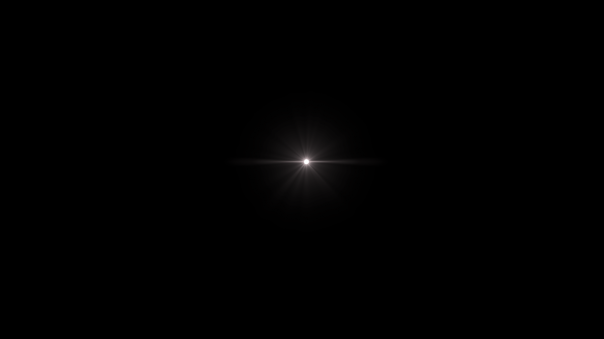
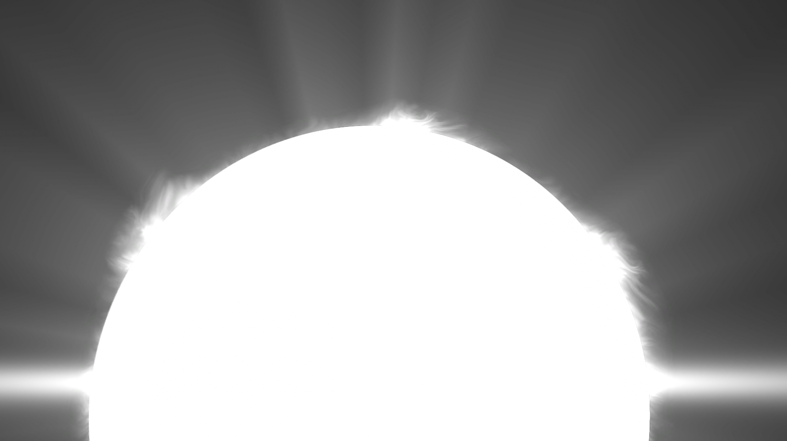
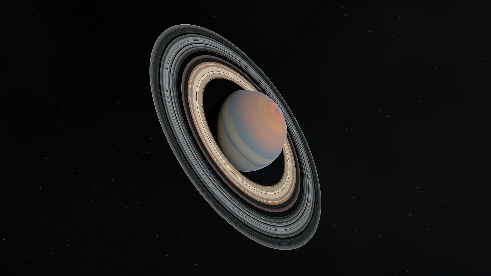
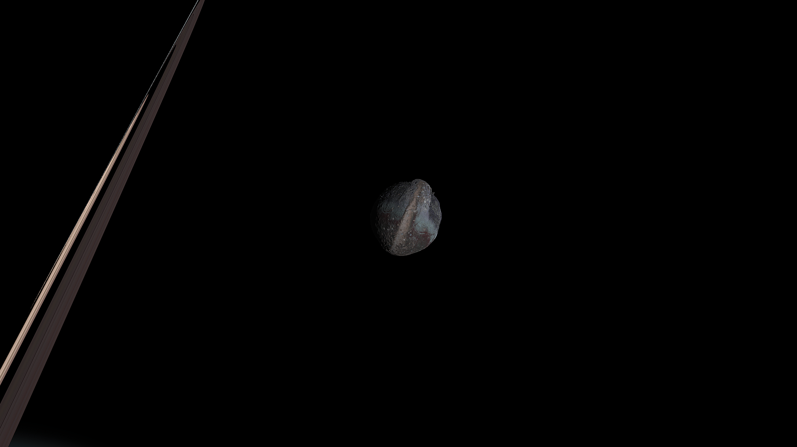
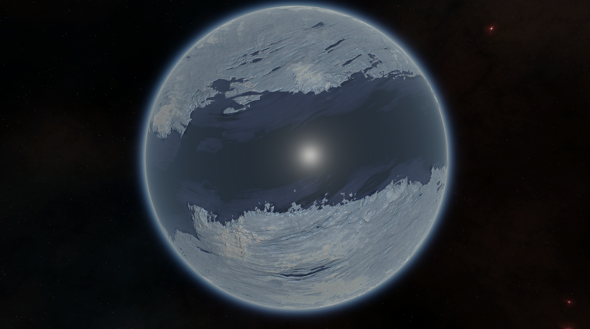

# The Tuun System

**DESCRIPTION**

Dense and alien, the Tuun System is a prime destination for daring explorers. Eleven exotic worlds are anchored around a massive, F-Class star. Brave the barycenter of Rask and Rusk, navigate the depths of Puf's superocean, and dive into Verda's cloud deck in this ultimate interstellar adventure.

**SYSTEM LAYOUT**

- Tuun - Bigger, brighter, hotter, mass-ier, Tuun is an F-type main-sequence star, and is the brightest star in Kerbin's night sky. Its Goldilocks zone is massive, meaning this star system has more potential for life than the Kerbolar system! Maybe you'll turn over a rock and find a teeny-tiny space center.

- Hurr - There's nowhere as windy and as blustery as Hurr. Tidally-locked to Tuun, the side facing the sun is constantly blasted with heat, while the dark side is hidden away, forever a cold bleak landscape of snow and ice. Temperatures are much more liveable along the terminator, with some spots of liquid water. It's a great place for generating power. Wind and sun are plentiful here! Just be careful where you place your colony...

- Rask & Rusk - You've never seen siblings fight like this! The fiery twins Rask and Rusk were born after their gargantuan parent proto-planet was split in half, leaving two planets now trapped in an endless destructive spiral. Their immense gravity and proximity means they are slowly ripping each other apart. Be careful when flying near this pair, lest you be caught in the crossfire!

- Rem - The warm and watery Rem is covered completely by a planet-wide ocean. Its high but comfortable gravity and a thick oxygen atmosphere makes it a good location for a colony, and its ring system and tall cloud stacks make for a stunning view. Those shallow parts are mesas that rise up to just below the water. We could build a platform above the water there, though if it doesn't work out then we'd be stuck there. Remember your life jacket!

  - Flot - If you were to observe Flot from the seas of Rem, you would see stunning greenery divided by a vast network of hundreds of rivers, topped with fluffy water clouds. Flot's abundance of water and thick oxygen atmosphere give the right conditions for all sorts of complex life! See those big circular oceans? Those are deep water-filled impact craters. Perfect for diving!

- Verda - Verda is a mystery to us. Its entire surface is hidden by thick cloud coverage. Judging by this, it must have a good amount of water down there. That's all we know about it though, since we can't see anything. Verda could be made entirely from noodles and we wouldn't know until we went there. It's a warm planet and may support some noodly life.

- Puf - When we first observed Puf, we were shocked to see it staring right back at us. That pupil-like sea is no ordinary sea, but the deepest sea we've ever seen, eating over 100km into the ground. These depths were likely formed when an asteroid carved through Puf's low-density surface. The thin methane atmosphere and unusually low gravity makes it a relatively easy destination. We can't quite describe it, but there's something unsettling about this planet...

- Glumo - Groovy Glumo is truly one of a kind. Between the iconic rings and colorful satellites, there's no place quite as stunning. Uniquely, it rolls on its side with a 63° axial tilt. Its gaseous outer layer, containing water, ammonia and ammonium hydrosulfide ices, interacts with the light in different ways per season, causing extreme color changes. As a result, astronomers have on numerous occasions mistaken it for a completely different planet!

  - Noj - Noj is a shepherd moon formed from the accretion of ice and other silly things encountered while orbiting Glumo's ring system. Dust stains the ice to create lovely pops of color on it's surface. Pretty colors aside, scientists can't shut up about the initial readings from Noj, and they want more data, if we can get there.

   

  - Merbel - Merbel has gone a different aesthetic direction from other celestial bodies. It dons a bold sea of methane and ammonia between its two massive ice caps. The dizzying rotation speed and low inclination gets the equator a lot of Tuun's attention. Merbel's orbital plane is completely off from Glumo's equator, suggesting it was once a planet itself that got captured by Glumo. Other moons may have been destabilized, possibly creating Glumo's iconic rings!

  

- Skut - Skut is the funkiest chunk of rock around! See how it looks like two asteroids fused together? Well we think that's how it got its unique arrowhead shape. Skut's shape isn't the only oddity though. Its wildly eccentric orbit sees it pass extremely close to Tuun and then back out into the farther reaches of the system. Maybe it can't decide where to set the thermostat.

*The Systems of Promised Worlds may change in-between updates. Please notify the Dev team if this is out of date, or make an issue on this repository.*

---

*The Tuun system is currently a Work in Progress. The current implemented bodies as of 1.2.1 are:*

- Rask/Rusk
- Puf

*Upon the release of 2.0.0, Promised Worlds will shift Glumo/Noj/Merbel from their current residences of The Debdeb System to The Tuun System, as it was in KSP 2. If you still see this message after the release of 2.0.0, please notify the Dev team, or make an issue on this repository*
