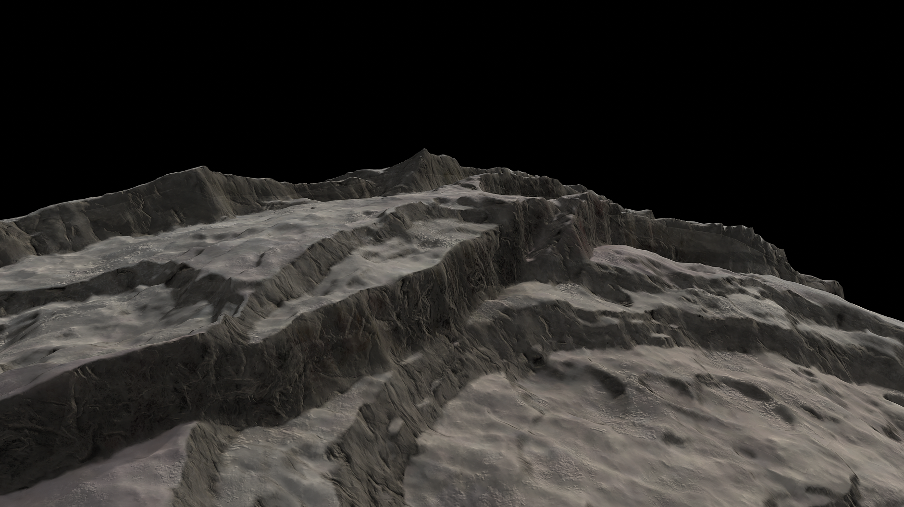
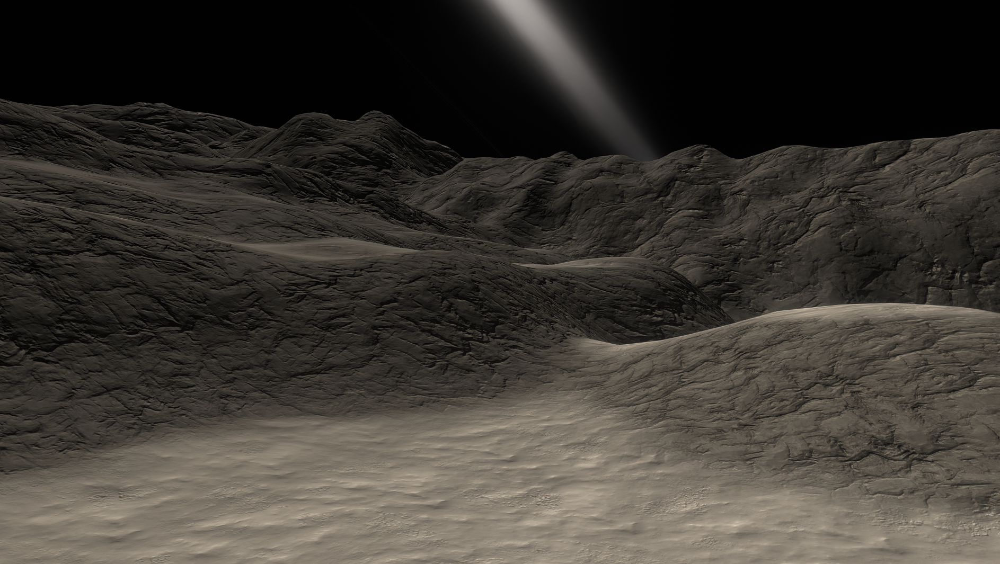

# Axod

The skewed dwarf planet Axod spins so fast that its hemispheres have offset over time, giving it a unique shape and creating the highest cliffs Kerbalkind has ever seen. We're hoping to transport Kerbin's most extreme sports personalities here to perform some insane stunts with Axod's thin ring system and small moon, Umod, in the background.

## Object Info

- Diameter: 190 Kilometers
- Radius: 95 Kilometers
- Semi-Major Axis: Roughly 48 million Kilometers
- Inclination: none
- Rotational Period (In Seconds): 4800
- GeesASL (At Sea Level): 0.1G's

## A look at Axod Close-up:

Axod is Quite the place! Because the dwarf planet spins so rapidly, once every 80 minutes, the planet has begun to fling itself apart, creating cliffs so tall it looks comical!

A look at the cliffs from the eyes of a Kerbal

One of the smaller rifts/valleys from above

A look at one of Axod's many mountains

*The Systems of Promised Worlds may change in-between updates. Please notify the Dev team if this is out of date, or make an issue on this repository.*