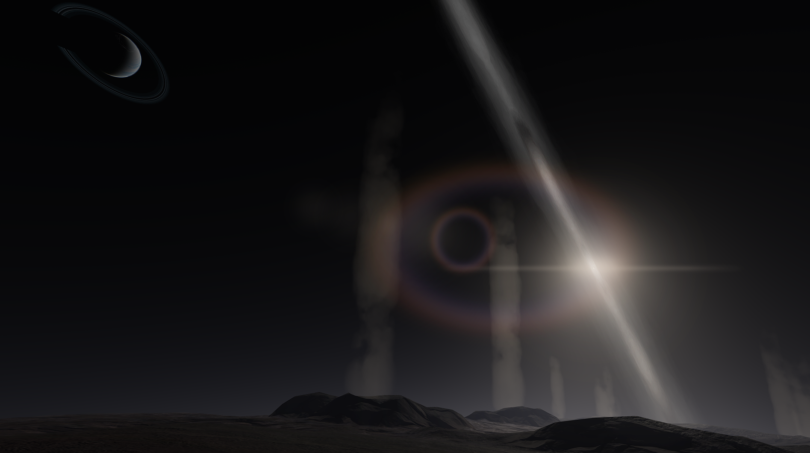

# Bis

This ball of ice was named for its crinkly cantaloupe terrain and canyons resembling a crunchy ice biscuit. The crust, made of ammonia, water, and nitrogen ice, conceals the liquid ocean beneath. This ocean causes extreme cryovolcanism leading to eruptions and crimson stains across the surface, especially inside of the canyons. Large impacts have formed flat planitia around the place, reminding you of Minmus. It also has a thin atmosphere.

## Bis Description

Bis is just plain ice. Astronomers once thought they should have named it Bice, but then the astronomers later clarified that meant Blue-Ice, or Bis. This is the name we settled on. The moon of Dorau is also known for being quite the spectacle with it's cryovolcanic plumes.

## Object Info

- Diameter: 360 Kilometers
- Radius: 180 Kilometers
- Semi-Major Axis: Roughly 41,900 Kilometers
- Inclination: 74 degrees
- Eccentricity: 0.6
- Rotational Period (In Seconds): 75,800
- GeesASL (At Sea Level): 0.189G's

## A look at Bis Close-up

Bis is frequently known for it's cryovolcanic plumes, which oddly is the most interesting thing about this moon. It surface is dazzled with dirty ice, but from afar, it looked rather blue. Oh well, mistakes are made in astronomy. Mentioning that, It also appears blue due to it's low and hazy atmosphere. You'll occasionally spot Dorau Rising in the distance

*The Systems of Promised Worlds may change in-between updates. Please notify the Dev team if this is out of date, or make an issue on this repository.*
