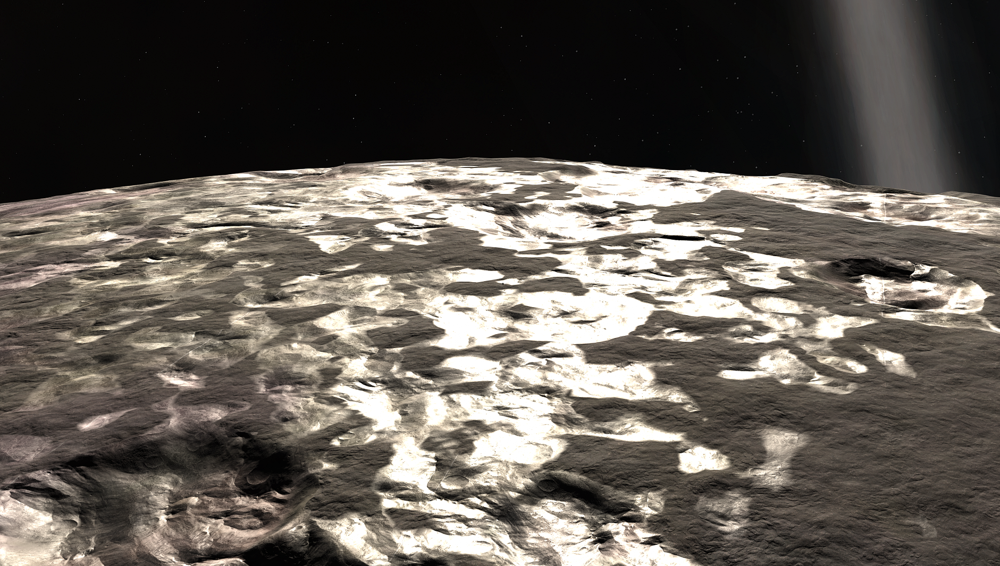

# Charr

Do you love sunbathing? Charr is your new best friend. This bombarded hunk of iron is snuggled up right next to Debdeb, glowing bright red from the heat. Despite being smaller than Kerbin, its mighty density gives it almost twice the gravity of Kerbin! There's likely an abundance of rare metals and materials here.

## Detailed Explanation of Charr:

Charr is a molten paradise, if you want to call it that. Comprised of iron, rocks, and some... questionable things. More on that later, that's for the player to discover. Charr's Molten lakes are very hot, so it's quite important to not hover above the lakes, or go near them. It also receives lots of solar rays from Debdeb, amplifying it's surface temperature even more!

As stated from interviews with KSP 2 Developers, every celestial body in KSP 2 was supposed to feature a challenge. Charr is certainly one of those bodies, as it's density compared to other objects, besides Ovin, is very high gravity, with nearly 2x Kerbins gravity at 1.91G's. Making landings here is certainly difficult, and if you do manage, might want to take a look around the lava lakes. You might find interesting things.

## Object Info

- Diameter: 982 Kilometers
- Radius: 491 Kilometers
- Semi-Major Axis: Roughly 2.2 million Kilometers
- Inclination: none
- Rotational Period (In Seconds): 298,100
- GeesASL (At Sea Level): 1.91G's

## Images of Charr's Surface:

*The Systems of Promised Worlds may change in-between updates. Please notify the Dev team if this is out of date, or make an issue on this repository.*
