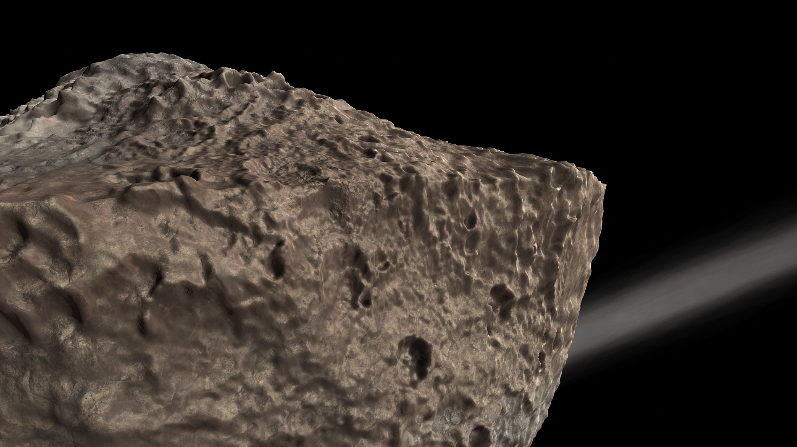
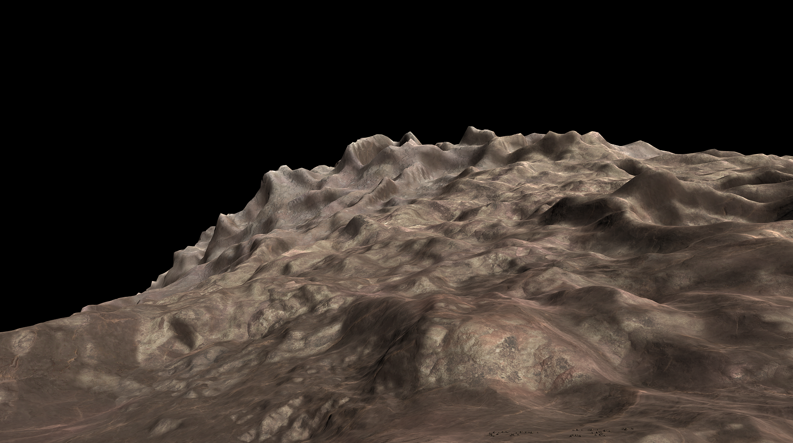
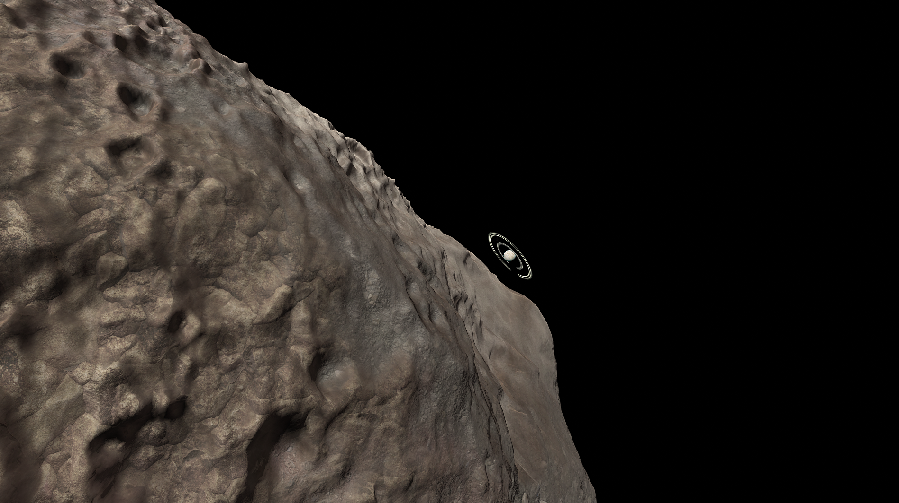

# Gup

This little nugget was flung into a far elliptical orbit, likely after the recent collision that formed Donk. It spins very fast which has flattened it into a disk shape. Landing around the equator is extremely difficult thanks to this spin.

## Detailed Explanation of Gup:

Gup is a little tiny Oblate Moon of Gurdamma. It orbits very far out, and is quite the spectacle, that is if you're on Gup itself.

## Object Info

- Diameter: 16,000 Meters
- Radius: 8,000 Meters
- Orbits: Gurdamma
- Semi-Major Axis: Roughly 38,300 Kilometers
- Inclination: 20 degrees
- Eccentricity: 0.6
- Rotational Period (In Seconds): 6,000
- GeesASL (At Sea Level): 0.0075G's

Gup's poles are quite interesting, with lots of moutains, however, don't expect to ski on them. You're more than likely to just float off into the dust of the Protoplanetary Disk.

Gurdamma rising over Gup.

*The Systems of Promised Worlds may change in-between updates. Please notify the Dev team if this is out of date, or make an issue on this repository.*
