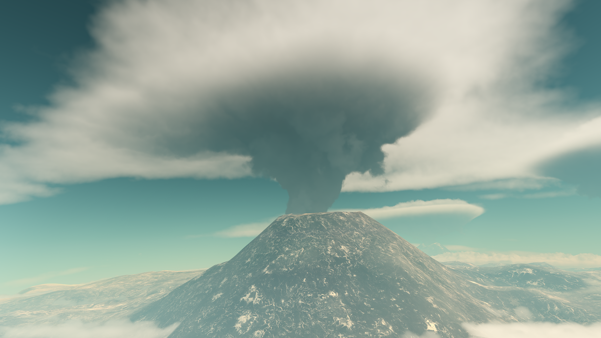
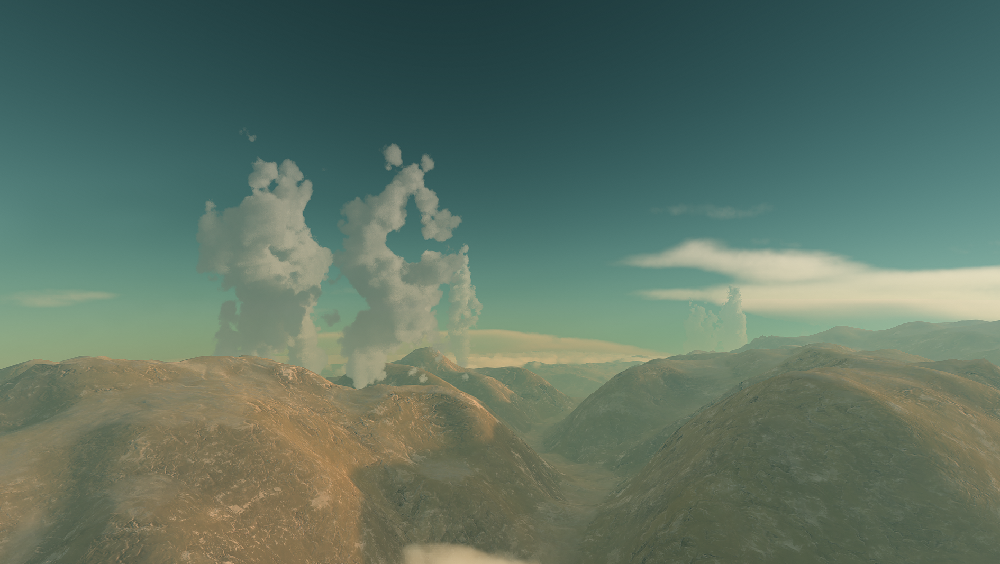
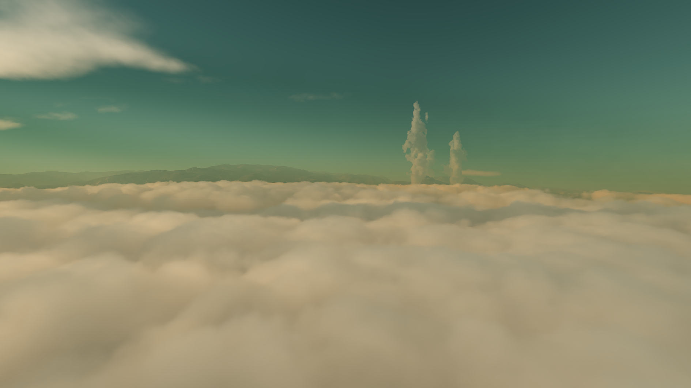
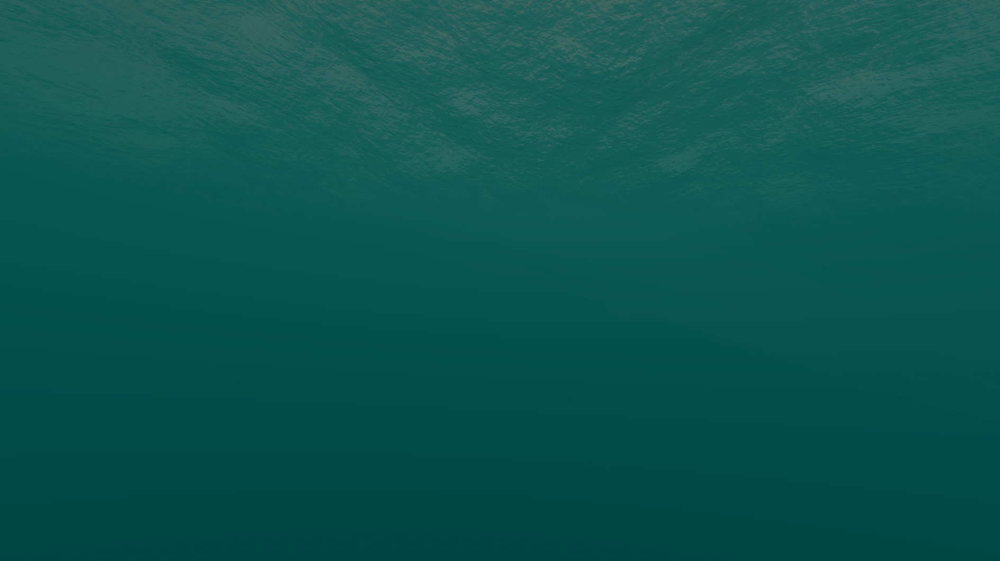
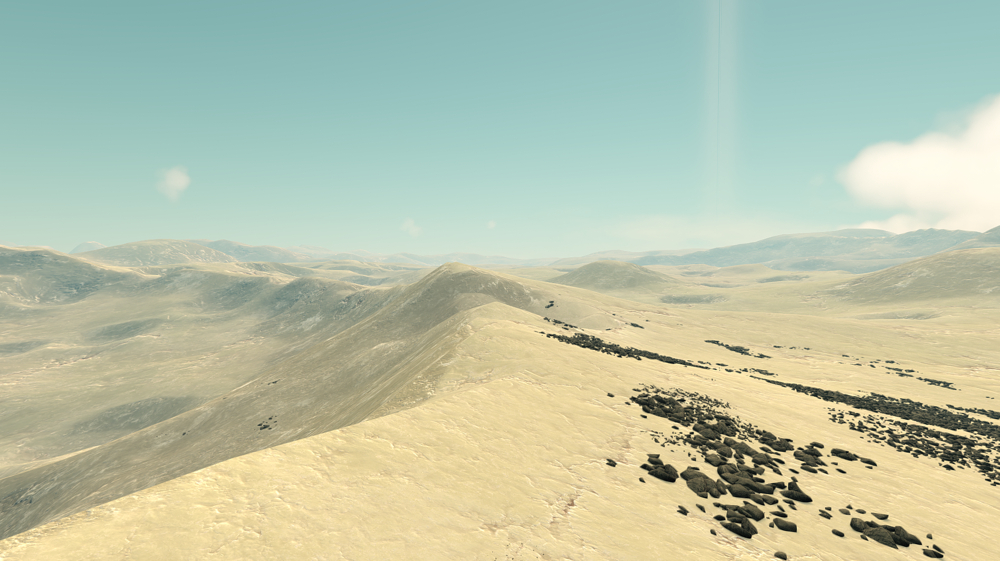
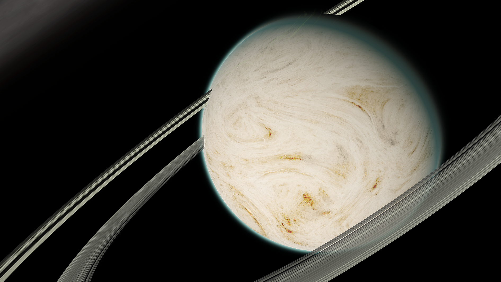

# Gurdamma

Gurdamma's bombarded surface, rapid spin and large close moon are evidence of a massive collision in the recent past. This along with its size and mass means that this young planet offers a glimpse at what early Kerbin may have looked like. Tidal forces exerted on Gurdamma from its largest moon, Donk, create giant tidal waves and extreme global volcanism. The plumes from these volcanoes reach high into the atmosphere and are one of the most prominent features when the planet is viewed from space.

## Detailed Explanation of Gurdamma:

Gurdamma is basically a scientist's dreams come true! It's essentially a Proto-Kerbin with lots of Proto-Goop, or the building blocks of life. The environment is very similar to kerbin, but it's atmosphere is quite hostile, as well with all the ash in the air from Gurdamma's Volcanoes. You'll find landing here quite the breeze, but getting back up is harsh at the atmosphere is quite thick! You'll need some fin's or some method of aerodynamic stabalization! Best of luck!

## Object Info

- Diameter: 1,160 Kilometers
- Radius: 580 Kilometers
- Semi-Major Axis: Roughly 10.1 million Kilometers
- Inclination: none
- Rotational Period (In Seconds): 7,920
- GeesASL (At Sea Level): 0.94G's

## A look at Gurdamma Close-up:

Gurdamma has the nicest dual rings you'll ever see. Cleared out by what scientists are calling a 'proto-Mun,' Donk.

A look at Gurdammas volcanoes, along with it's surface, and surrounding clouds.

Because of rapid Volcanic activities and fissures around the planet, there are quite a few side effects, as well as the greenhouse effect taking place.

You can find lots of goop in Gurdamma's vast Green/Blue oceans!

It's thought there are vents beneath the ocean's surface, which if true, Kerbin scientists might be able to confirm if this is how life started on Kerbin.

On Gurdammas surface, you'll find a collection of rock, ash, and a heavy presence of recent, and occuring geological activity:

You'll also occasionally find craters filled with water. One must investigate the goop of Gurdamma.

Occasionally, Gurdamma has Volcanic Winters, caused by heavy Geological activity from both it's moon, Donk, and it's own Geological activity. One must wonder how life survived in such a hostile, yet serene and peaceful environment. 

*The Systems of Promised Worlds may change in-between updates. Please notify the Dev team if this is out of date, or make an issue on this repository.*
