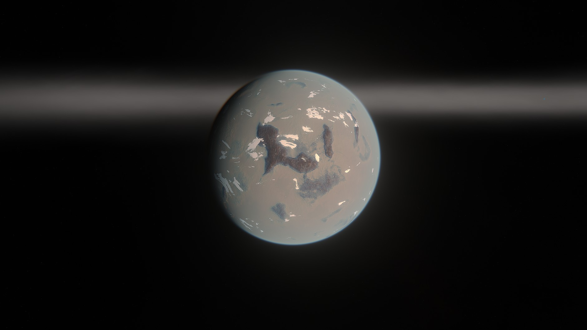
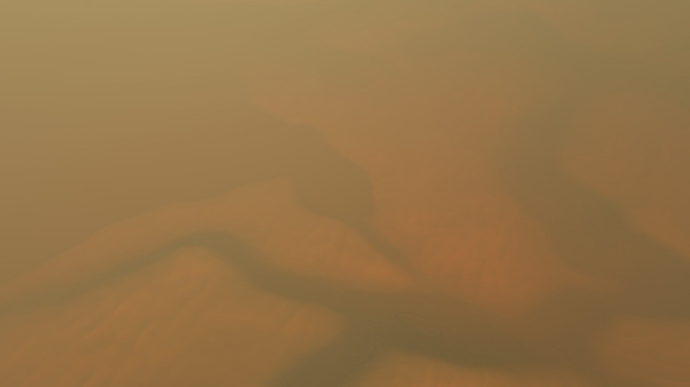
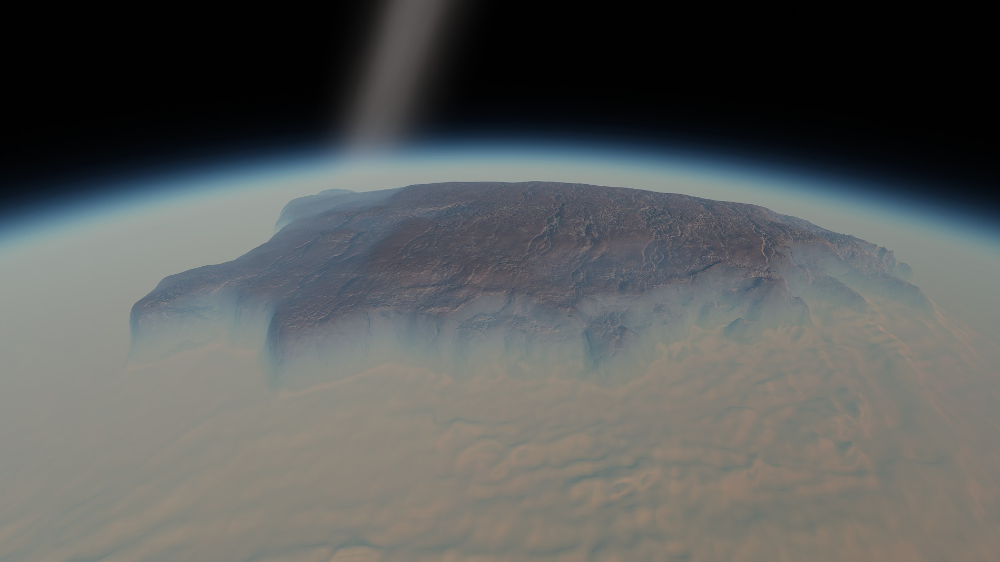
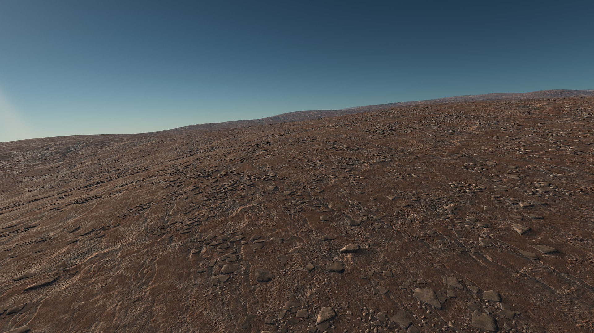
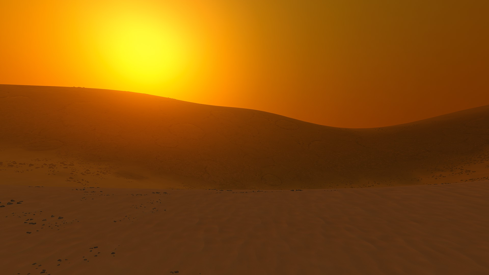
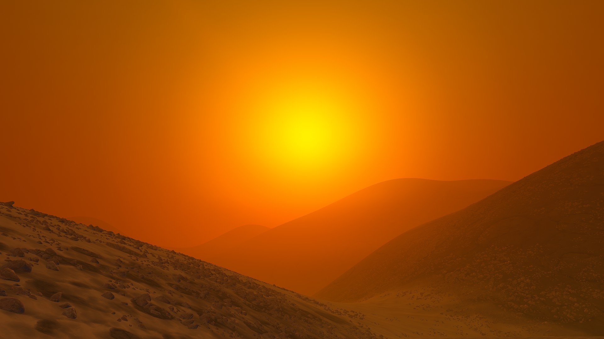
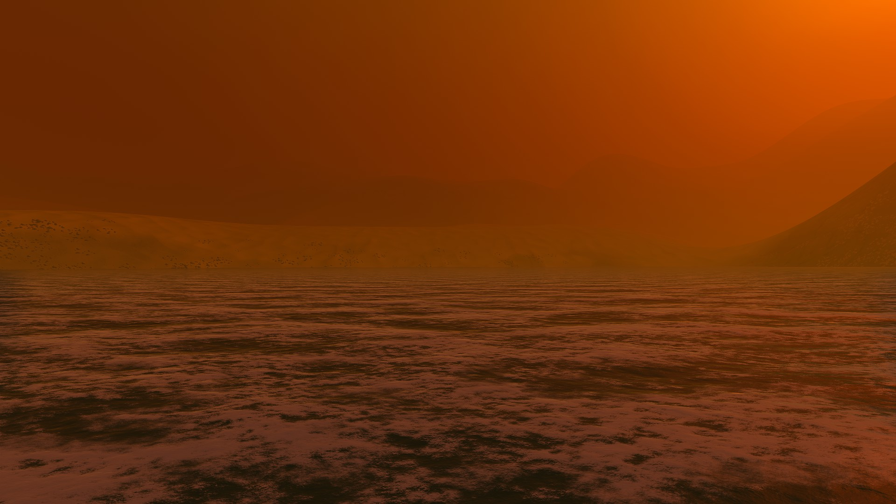

# Lapat

Lapat's thick carbon dioxide wraps it in an eerie shroud. Through the smog, we can just about make out dots of foamy water amongst dunes of white sand. Lapat's most striking features are its great mesas that climb high into the sky, escaping the soupy environment around their bases. If you fancy a hot summer day then Lapat is the place! Unless you also fancy suffocating and being crushed like a can..... Pluses and minuses.

## Object Info

- Diameter: 1090 Kilometers
- Radius: 545 Kilometers
- Semi-Major Axis: Roughly 14 million Kilometers
- Inclination: none
- Rotational Period (In Seconds): 35000
- GeesASL (At Sea Level): 1.2G's

## A look at Lapat Close-up:

Lapat's thick atmosphere and photochemical smog obscures the lower elevations from space almost completely, while the mesas rise through the haze.

On the top of the mesas, the atmospheric pressure is nearly the same as Kerbin's, making an ideal location for a base!

On the surface, the light from Debdeb is filtered by the smog, creating an eerie orange glow.

The lowest points on Lapat are filled with foamy water, possibly from dissolved carbon dioxide.

*The Systems of Promised Worlds may change in-between updates. Please notify the Dev team if this is out of date, or make an issue on this repository.*
