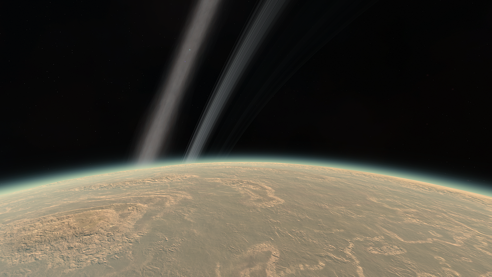

# Ovin

A choked atmosphere, a shattered surface and gravity that will tear you to shreds. Ovin is terrifying. We don't know how a planet like it could form. Everything about it defies our understanding of terrestrial planets. Its discovery gave many scientists nightmares for weeks afterwards.

## Detailed Explanation of Ovin:

Ovin spells disaster for any lander or ship that manages to skim above it's super thick Green and Yellow atmosphere. Once you're in, there is very little chance you're escaping. With nearly 4x Kerbin's graity, Ovin has been sucking up ships since Kerbals first set out for the stars. It's probably a really good idea to pack a ship/lander with lots of staging, lots of delta v, and a massive TWR. Otherwise, you may have to send a rescue mission.

## Object Info

- Diameter: 1,920 Kilometers
- Semi-Major Axis: Roughly 6.9 million Kilometers
- Inclination: none
- Rotational Period (In Seconds): 89,560
- GeesASL (At Sea Level): 4G's

## A look at Ovin Close-up:
Ovin's Surface

Ovin's Rings

With major flares coming from the young star that is Debdeb, any planet with a significant magnetic field will have Aurora. Such here, Ovin has Polar Aurora. No doubt about it, considering it's massive gravitational field.

*The Systems of Promised Worlds may change in-between updates. Please notify the Dev team if this is out of date, or make an issue on this repository.*
