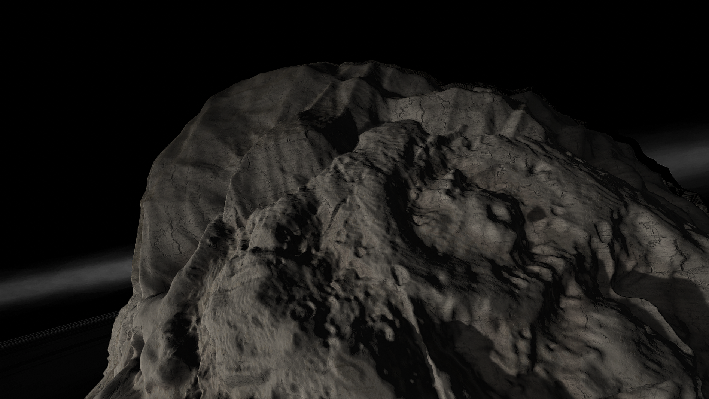
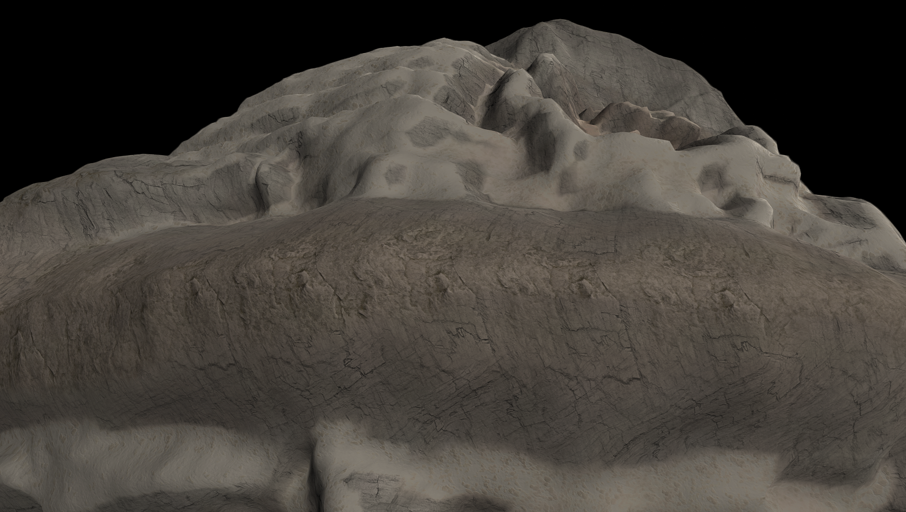

# Umod

Umod bears many battle scars. This shattered moon of Axod is putting itself back together after a violent past. While its divets and folds don't hold a flame to its parent body, the swirling patterns and coloration make it stand out. It's oddly delicious looking...

## Object Info

- Diameter: 56,000 Meters
- Radius: 28,000 Meters
- Semi-Major Axis: Roughly 22 thousand Kilometers
- Inclination: none
- Eccentricity: 0.2
- Rotational Period (In Seconds): 7,400
- GeesASL (At Sea Level): 0.009G's

## A look at Umod Close-up

Umod is the subject of it's violent past. If not for KSP 1's own limitations, this entire system (Axod/Umod) Would be tilted on it's side!

Umod's south pole features a staggering, and quite jarring mountain. From here, you can spot it's faint rings, as well as the occasional glimpse at Axod.

Like all small and fastly rotating objects, Umod features an equatorial Mountain ridge! Complete with skis to survive the low gravity fall!

*The Systems of Promised Worlds may change in-between updates. Please notify the Dev team if this is out of date, or make an issue on this repository.*
