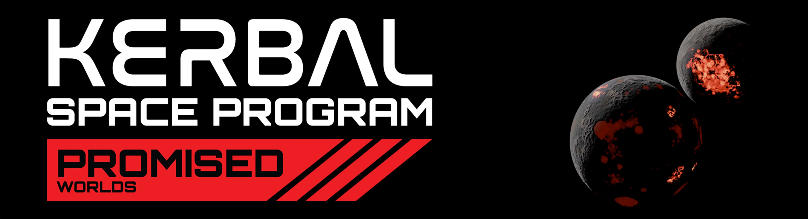

 

# Promised Worlds

## Welcome to the Promised Worlds Wiki

**Promised Worlds is a faithful revival of the solar systems Intercept Games planned to release for KSP 2 implemented fully into KSP 1. Want to brave the crater lakes of Gurdamma? Launch between the molten seas of Rask and Rusk? Our team of veteran KSP 1 modders is working around the globe to bring you those experiences—and more!**

## Promised Worlds Progress

So far, we have implemented the Debdeb System. The Tuun System is in the early stages of development, with a few planets implemented in the public releases. The Qeg System is being conceptualized (an uncertain feature).

Promised Worlds is currently in early access. Planets, moons, and other features are being added in our [Releases](https://github.com/PromisedWorlds/PromisedWorlds/releases).

The current build of Promised Worlds contains a mix of planets (and some entirely new bodies) that use our creative imaginations and fuses the understandings of our previous findings. 

We have now realized that some of our findings (as of release v1.2.1 and prior) were mostly mixed and misunderstood from our new findings, and as such, lots of changes are taking place.

With this new info we have discovered, we are nearing our next release, which is the Debdeb Revamp. The update aims to accurately represent what the developers intended for The Debdeb System in KSP 2, with only a handful of features left to add.

After the release of the Debdeb Revamp, we plan to focus on completing the Tuun System as accurately as possible to the KSP 2's developers intentions.

Other features may be incrementally added in patch updates.

## How we create Promised Worlds

All content for Promised Worlds is being designed in-house. We are not using any KSP 2 assets. 
 
Each world has been meticulously crafted to align with KSP 2 development screenshots and data mining discoveries. For celestial bodies lacking implementation details (e.g., Umod, Gup), we are currently applying creative liberties to attain what we feel were the KSP 2 developers' intentions.

## Getting Started

 - To install Promised Worlds, follow this [Installation Guide](https://promisedworlds.github.io/PWiki/Installation/)

## Explore the star systems of Promised Worlds

 - [Debdeb System](https://promisedworlds.github.io/PWiki/Debdeb%20System/)
 - [Tuun System](https://promisedworlds.github.io/PWiki/Tuun%20System/)
 - [Qeg System](https://promisedworlds.github.io/PWiki/Qeg%20System/)

## Other useful info

 - View our current [Changelog](https://promisedworlds.github.io/PWiki/Changelog/)
 - View the [Accuracy of Promised Worlds](https://promisedworlds.github.io/PWiki/Promised%20Accuracy/)

## Community

If you want to stay up to date with progress or contribute, join our [Discord server](https://discord.gg/cuY2Hx2emM)!

---

*The Systems of Promised Worlds may change in-between updates. Please notify the Dev team if this is out of date, or make an issue on this repository.*
