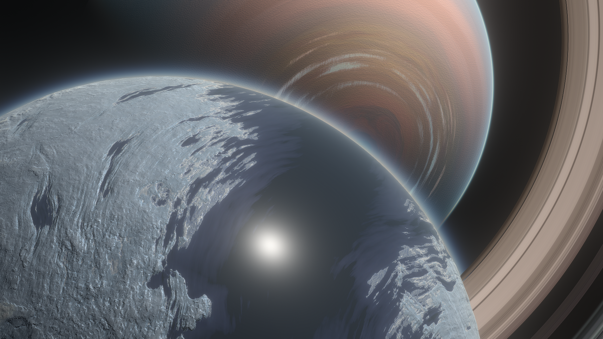
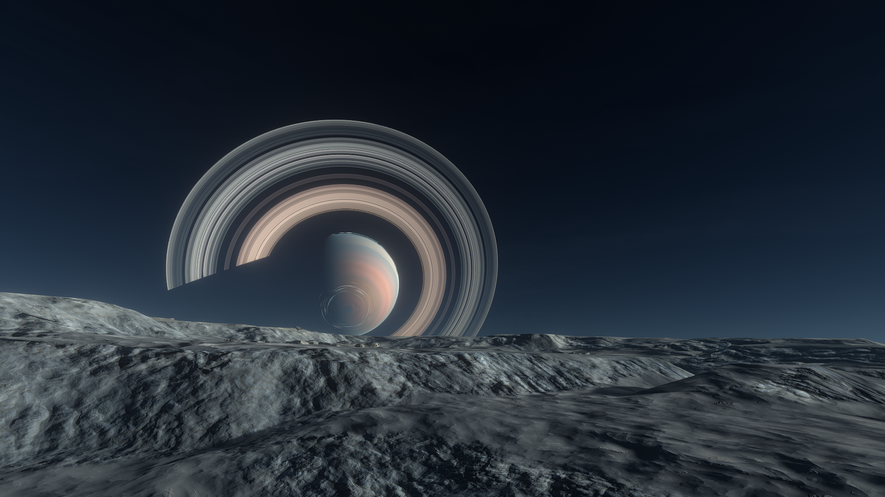
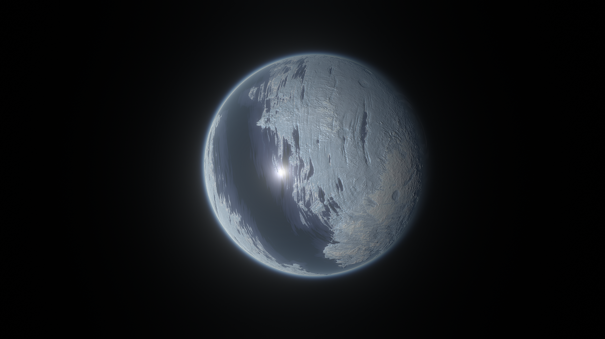
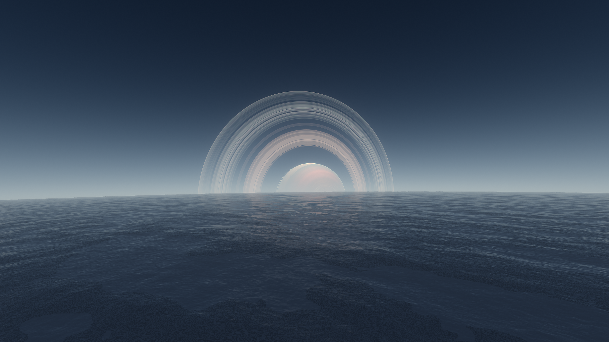

# Merbel

## Merbel Description:

Merbel has gone a different aesthetic direction from other celestial bodies. It dons a bold sea of methane and ammonia between its two massive ice caps. The dizzying rotation speed and low inclination gets the equator a lot of Tuun's attention. Merbel's orbital plane is completely off from Glumo's equator, suggesting it was once a planet itself that got captured by Glumo. Other moons may have been destabilized due to it's influence, possibly creating Glumo's iconic rings!

## Detailed Explanation of Merbel

Merbel strikes many unique geographical formations, due to it's mostly methane ice crust, and wind-chilled deserts. The chilling winds are so repetitive on Merbel that they have formed Ice-streaks across the surface, and have since formed everlasting ice-caps.

## Object Info

- Diameter: 812 Kilometers
- Radius: 406 Kilometers
- Orbits: Glumo
- Semi-Major Axis: Roughly 65 thousand Kilometers
- Inclination: 1 degree
- Eccentricity: 0.3
- Rotational Period (In Seconds): 28,800
- GeesASL (At Sea Level): 0.46G's

# Merbel's Poles

Merbel also features very calm and faint aurora on it's poles. It's quite the place for an outpost as Glumo rises and sets in the distance, as well as seeing the rest of the Tuun planets from here!

# Merbel's Oceans

Merbel also featuers a striking equatorial nearly frozen ocean, which near the coasts will freeze methane bubbles trapped in icebergs.

## General Tips for Merbel
If you plan to visit merbel, make sure to pack hiking boots with spikes, as the terrain is quite slippery, and basically always frozen in the cold!

*The Systems of Promised Worlds may change in-between updates. Please notify the Dev team if this is out of date, or make an issue on this repository.*
