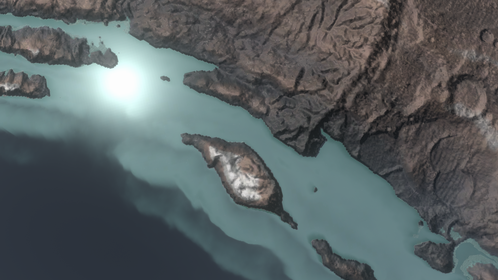
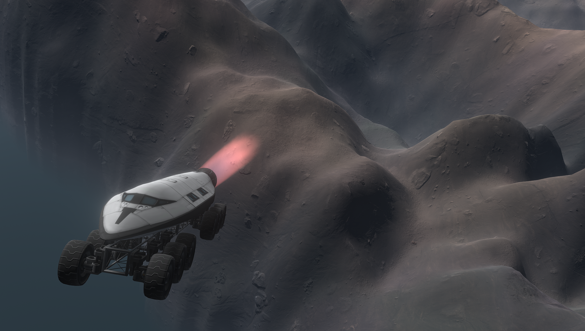

# Puf

When we first observed Puf, we were shocked to see it staring right back at us. That pupil-like sea is no ordinary sea, but the deepest sea we've ever seen, eating over 100km into the ground. These depths were likely formed when an asteroid carved through Puf's low-density surface. The thin methane atmosphere and unusually low gravity makes it a relatively easy destination. We can't quite describe it, but there's something unsettling about this planet...

## Detailed Explanation of Puf:

Puf's unsettling nature is due to it's extremely deep ocean, nearing 100km deep, as well as it's extremely low density, resulting in a Gravity (at sea level) of 0.22G's. It also features stunning cliffs near it's eyeball ocean, and a very thin atmosphere.

## Object Info

- Diameter: 900 Kilometers
- Radius: 450 Kilometers
- Semi-Major Axis: Roughly 120 million Kilometers
- Inclination: 24 degrees
- Rotational Period (In Seconds): 51,200
- GeesASL (At Sea Level): 0.22G's

## A look at Puf Close-up

Puf's Oceans are extremely deep. For a planet that has little color, it sure makes an excuse to showcase it's Oceans.

Puf's terrain is calm, yet violent. If this planet had a fair bit of density, the terrain would be very difficult to navigate with rovers. Thankfully, it's as dense as a cloud!

Because of Puf's extremely low density and gravity, you can pull off fun little tricks like this!

Puf's poles sway because not only of it's tilt, but it's orbit relative to Tuun, with 24 degrees of roam. Sometimes the poles are at night, and sometimes they are in the Tuun-light! With the low gravity, barely any atmosphere, and a deep, treacherous ocean, Puf's poles might be the right home for a base! Quickly building rockets with deep-sea probes from Puf's surface to deploy into it's Lceans is probably your best bet for exploring Puf!

*The Systems of Promised Worlds may change in-between updates. Please notify the Dev team if this is out of date, or make an issue on this repository.*
