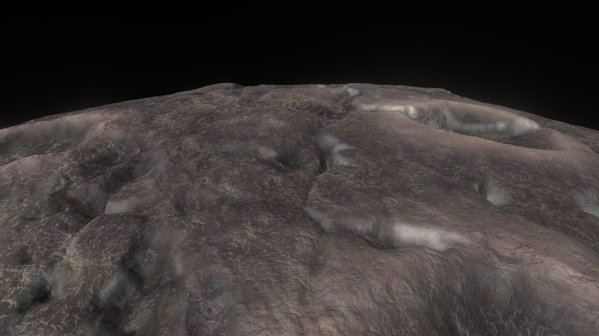
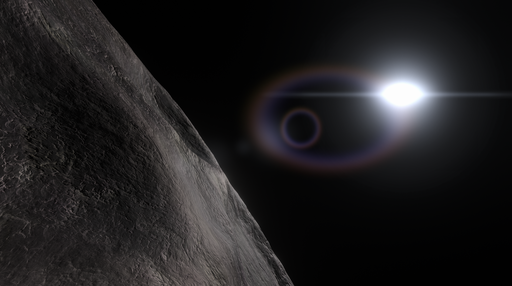
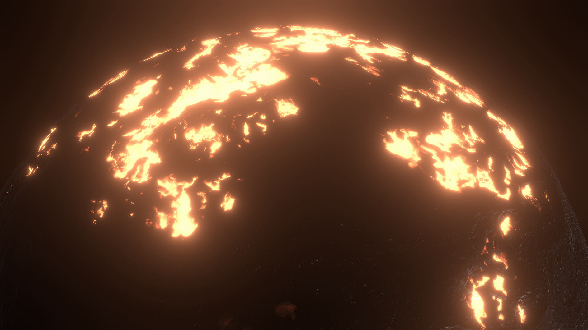
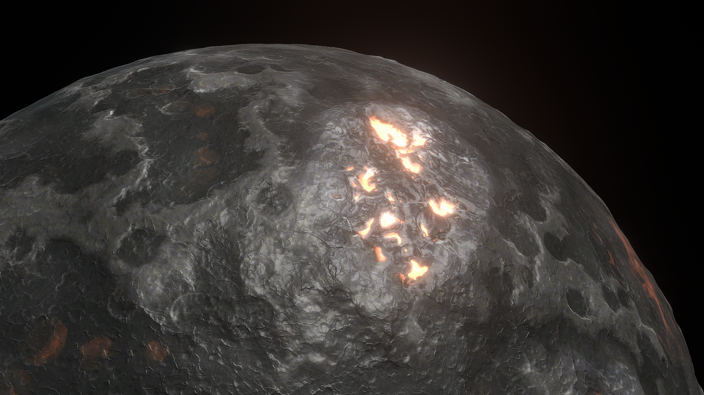

# Rask & Rusk

You've never seen siblings fight like this! The fiery twins Rask and Rusk were born after their gargantuan parent proto-planet was split in half, leaving two planets now trapped in an endless destructive spiral. Their immense gravity and proximity means they are slowly ripping each other apart. Be careful when flying near this pair, lest you be caught in the crossfire!

# THE DANGER ZONE

- The fly zone between Rask and Rusk has been a difficult puzzle to Kerbin's best scientists for ages. If you plan to venture between the mighty twins, it's suggested you take a craft with a lander attached. Sometimes you will get slingshotted out of their Sphere Of Influence, so plan accordingly!

## Binary Object Info

- Semi-Major Axis: Roughly 16 Million Kilometers
- Inclination: 28
- Eccentricity = 0.3
- Sphere Of Influence = Roughly 8,740 Kilometers

# Rask

## Rask Description:

Rask is the larger and stronger of the binary pair. Less lava is pulled to the surface here due to the decreased impact of tidal forces. The crust here is rocky and easily cracks under the stress forming wide cracks across the planet.

## Object Info

- Diameter: 2500 Kilometers
- Radius: 1250 Kilometers
- Orbits: RaskRuskBarycenter
- Semi-Major Axis: Roughly 3,593 Kilometers (Barycenter)
- Inclination: none
- Rotational Period (In Seconds): 6,000
- GeesASL (At Sea Level): 2.5G's

Rask's lava oceans is the smaller of the two. It still displays prominence with it's blazingly hot oceans of lava.

Rask's rear side is a lot calmer, some areas are quite flat, while occasionally containing canyons and craters.

Rask's surface is more rocky than it's twin.

Here is what Rask looks like from an extremely low orbit:

# Rusk

## Rusk Description:

Rusk is taking a massive beating from its twin. Bright lava oceans streak across the planet, as if the planet is on fire. Rusk has a denser metallic crust, constantly being stretched and compressed as the two planets fight. This action causes dense hills and fissures to form, making landing difficult (if it wasn't already). Pack some extra fuel.

## Object Info

- Diameter: 2500 Kilometers
- Radius: 1250 Kilometers
- Orbits: RaskRuskBarycenter
- Semi-Major Axis: Roughly 3,593 Kilometers (Barycenter)
- Inclination: none
- Rotational Period (In Seconds): 6,000
- GeesASL (At Sea Level): 2.5G's

Rusk's lava ocean is certainly the bigger one, as well as brighter.

When orbiting low, and you will always orbit low due to the violent nature of the twin's gravity-wells, you can spot the twins rising and setting on their horizons.

Rusk occasionally has splotchy areas of molten lava, nearly cool in others.

Here is Rusk's surface. It's quite metallic, and very hilly. Landing here is quite the challenge, a bit easier than Ovin, but with a twist.

# General Tips for Rask/Rusk
- Orbit as low as you can, not too low, or you'll manage to either get flung out, or crash into one of the twins.
- Capturing around one of the twins is quite difficult, as the twins orbit eachother within mere hours. Plan accordingly.
- Bring a sufficient craft, with lots of Delta V and a very high TWR (4.0+).
- Burn efficiency is key. An optimal Suicide Burn is your best bet for landing on either of the twins.

*The Systems of Promised Worlds may change in-between updates. Please notify the Dev team if this is out of date, or make an issue on this repository.*